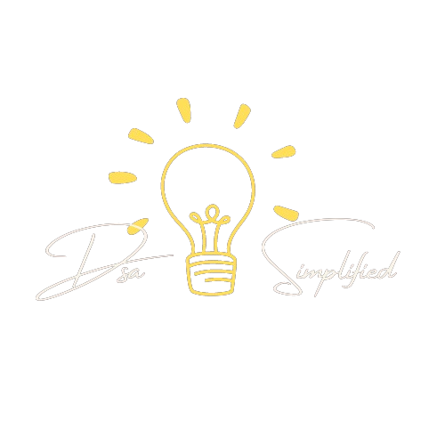

# DsaSimplified 💡



## Table of Contents

- [Introduction](#introduction)
- [Features](#features)
- [Live Demo](#live-demo)
- [Technologies Used](#technologies-used)
- [Getting Started](#getting-started)
- [Installation](#installation)
- [Usage](#usage)
- [Contributing](#contributing)
- [License](#license)
- [Contact](#contact)

## Introduction

Welcome to **DsaSimplified**! 🎉 This project is dedicated to simplifying Data Structures and Algorithms (DSA) through easy-to-understand blog posts. The application is built using ReactJs for the frontend and Appwrite for the backend, allowing users to create, read, update, and delete blog posts.

## Features

- ✏️ Create new blog posts
- 📖 Read existing blog posts
- 🔄 Update existing blog posts
- ❌ Delete blog posts
- 🔒 User authentication and authorization

## Live Demo

Check out the live demo of the project [here](https://dsasimplified.vercel.app/).

## Technologies Used

- **Frontend**: ReactJs
- **Backend**: Appwrite
- **Styling**: Tailwind-CSS
- **Deployment**: Vercel

## Getting Started

To get a local copy of the project up and running, follow these simple steps.

### Prerequisites

Ensure you have the following installed on your system:

- Node.js
- npm (Node Package Manager)
- Appwrite server (you can use the [Appwrite Cloud](https://appwrite.io/cloud) if you don't want to self-host)

### Installation

1. Clone the repository

```sh
  git clone https://github.com/Theyashsawarkar/Dsa-Simplified.git
```
2. Navigate to the project directory
``` sh
 cd Dsa-Simplified
```
3. Install the necessary dependencies
``` sh
 npm install
```
4. Configure Appwrite

- Create a new project in your Appwrite console.
- Create a new database for your blog posts.
- Update the Appwrite configuration in the project to match your Appwrite project details.
- Create a .env file from .env.sample and get the values for variables from Appwrite .

## Usage
Start the development server

```sh
npm start
```
Open your browser and navigate to
```sh
http://localhost:3000
```
You can now interact with the blog application.

## Deployment
To deploy the application, you can use Vercel or any other hosting service.

1. Push your local changes to GitHub.
2. Connect your GitHub repository to Vercel.
3. Deploy the project using Vercel's deployment process.

## Contributing
Contributions are what make the open-source community such an amazing place to learn, inspire, and create. Any contributions you make are greatly appreciated.

1. Fork the Project
2. Create your Feature Branch (git checkout -b feature/AmazingFeature)
3. Commit your Changes (git commit -m 'Add some AmazingFeature')
4. Push to the Branch (git push origin feature/AmazingFeature)
5. Open a Pull Request

## License
Distributed under the MIT License. See LICENSE for more information.

## Contact
Yash Sawarkar - [LinkedIn](https://www.linkedin.com/in/theyashsawarkar/)
  
